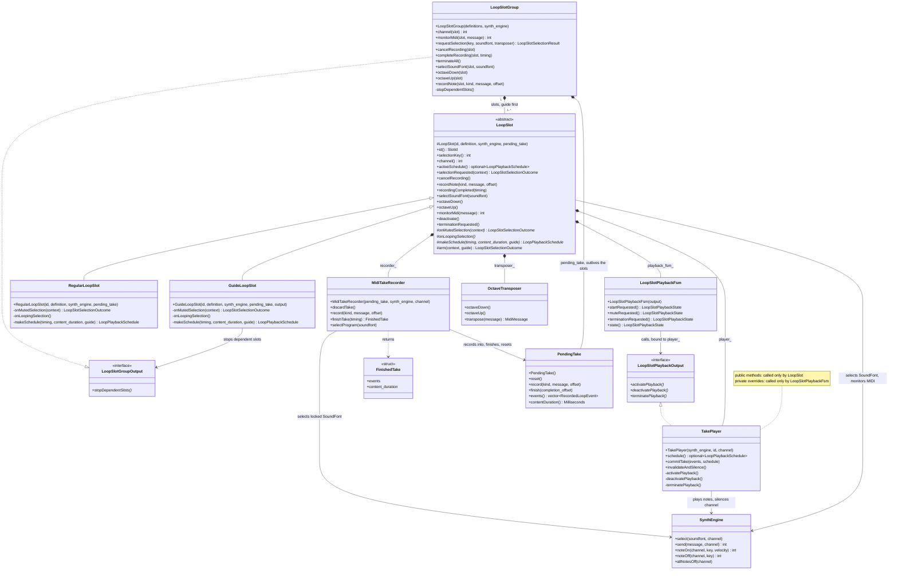

# Loop-slot classes

How the loop-slot classes own and call each other. Each box lists the class's
constructors, public and protected methods, and private overrides;
`SynthEngine` shows only the methods these classes call. Each file's
responsibilities are in [CONTRIBUTING.md](CONTRIBUTING.md), and the
[runtime sequence diagram](runtime-sequence.puml) shows the calls in order.

